---

# Questions

<style scoped>
h1 {
  font-size: 120px;
}
</style>

https://sli.do use code: #geecon


---


<!--
_backgroundColor: #002C77
_color: white
-->

# How do you picture Philips?


<!--
What are we doing here?
Philips is a worldwide recognisable brand almost everyone in the world has heard of Philips.
But you don't think of software.
How do you picture philips?
-->

---
<!--
_backgroundColor: #00629F
_color: white
-->

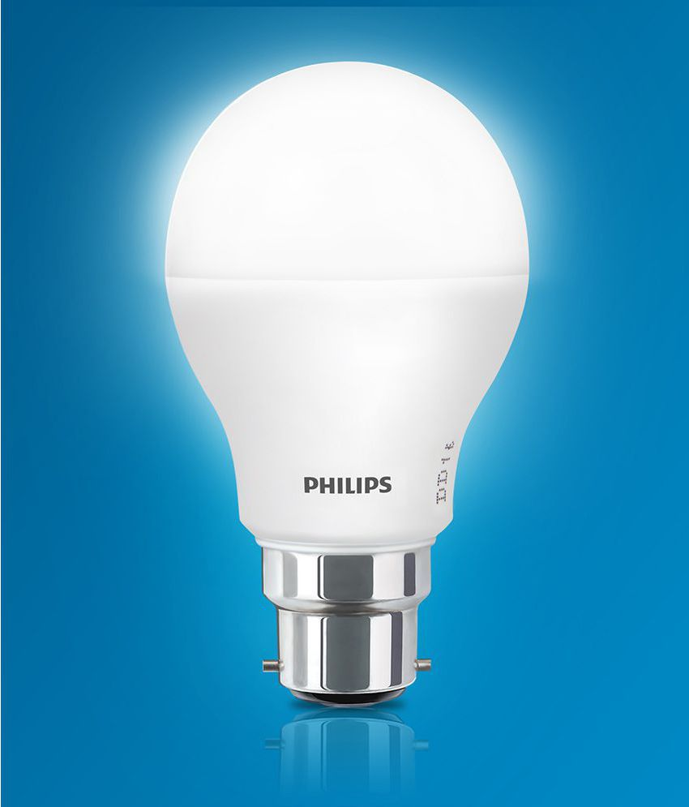

# Probably this?

---

# <!-- fit --> Not this


<!--
_backgroundColor: #0072DA
_color: white
-->


---

<!--
_backgroundColor: #0072DA
_color: white
-->

## Philips is a **health technology** company improving people's health and well-being through meaningful innovation

## Our purpose is to improve people’s health and well-being. We aim to improve 2.5 billion lives per year by 2030


---

<!--
_backgroundColor: #0072DA
_color: white
-->

# Software in Philips

- 8000+ software professionals

- Global organisation

- Global Organisation

- Regulated medical software


<!-- 
We build a lot of software in philips
We have a lot of different business units that historically have little alignment
 -->

---

<!--
_backgroundColor: #D10077
_color: #EABEDB
-->

# Adopting InnerSource

- Collaborate at Scale 

- Build on top of GitHub (SaaS)


<!-- 

InnerSource is key to our software strategy

In Philips we combine world class tools to enable teams to focus on meaningful innovation to improve people lives.

InnerSource is a development methodology where engineers build proprietary software using best practices from large-scale open source projects.
 -->

---


<!--
_backgroundColor: #D10077
_color: #EABEDB
-->

# Improve DevX

- How do we enable CI/CD?

- How do we bootstrap?

- How do we share assets?

- How do we help with compliance?


<!-- 

NOTES 

-->

---

<!--
_backgroundColor: #D10077
_color: #93C2F8
-->

# Enable CI/CD 
with GitHub Actions

```yaml
on: [push]
jobs:
  check-bats-version:
    runs-on: [ubuntu-latest]
    container: node:16
    steps:
      - uses: actions/checkout@v3
      - run: npx bats -v
```

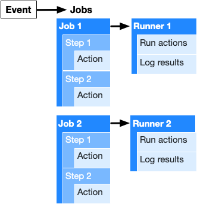


---

<!--
_backgroundColor: #269A91
_color: #244C5D
-->

## <!-- fit --> But how can we connect
## <!-- fit --> to our network?


---


<!--
_backgroundColor: #269A91
_color: #244C5D
-->

## <!-- fit --> ~~hosted runners~~
## <!-- fit --> self-hosted runners


---
<!--
_backgroundColor: #269A91
_color: #244C5D
-->

## <!-- fit --> Why self-hosted?


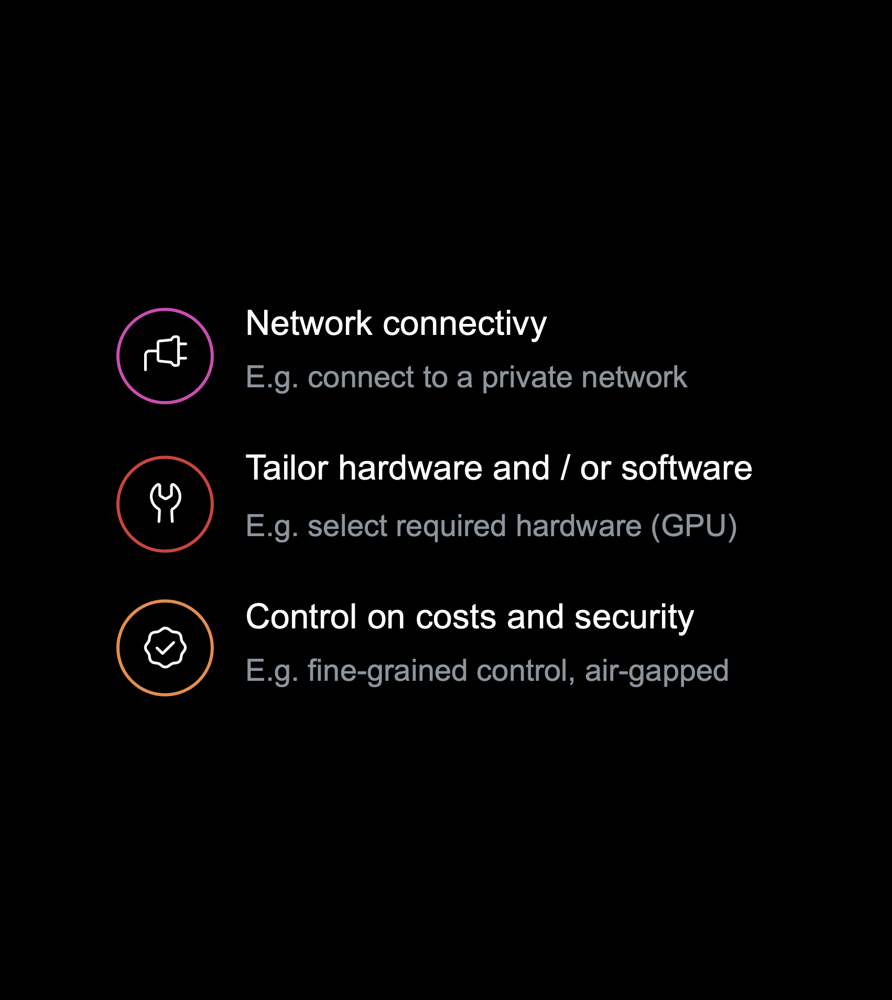

---

<!--
_backgroundColor: #000000
_color: #93C2F8
-->


# <!-- fit --> How to bring same DevX to self-hosted runners? 


---

<!--
_backgroundColor: #D10077
_color: #93C2F8
-->

<!--
_backgroundColor: #008540
_color: #144835
-->

# <!-- fit --> Manual?


<!-- 

- Scale?

- Sustainable?

- Maintenance?

-->


---

<!--
_backgroundColor: #D10077
_color: #6D1E4A
-->

<style scoped>
h2 {
  text-align: center;
  font-size: 75px;
  color:  #FABCDB;
}
</style>

# <!-- fit --> Event based

## Scale based on workflow jobs


---

<!--
_backgroundColor: #008540
_color: #144835
-->

<style scoped>
h2 {
  text-align: center;
  font-size: 62px;
  color: #A0DABB;
}
</style>

# <!-- fit --> Serverless

## low cost / low maintenance control plane


---

<!--
_backgroundColor: #269A91
_color: #244C5D
-->

<style scoped>
h2 {
  text-align: center;
  font-size: 75px;
  color: #7EDDDE;
}
</style>

# <!-- fit --> Treat as Cattle

## Secure and no fire fighting


---

<!--
_backgroundColor: #DE7C00
_color: #9B3426
-->

<style scoped>
h2 {
  text-align: center;
  font-size: 75px;
  color: #FDD37A;
}
</style>

# <!-- fit --> Networking

## Bring your own connection

<!-- 
Connectivity is abstract of the end solution. You bring the solution to your network and take advantage of it 
-->
---

<!--
_backgroundColor: #000000
_color: #93C2F8
-->

# <!-- fit --> 💡 Event based / serverless / cattle / byon 💡


---

<!--
_backgroundColor: #269A91
_color: #244C5D
-->

<style scoped>
section {
  font-size: 28px;
}
</style>

# Scalable self-hosted

**Serverless** contol plane receiving events from GitHub and scale new self-hosted runners using **AWS EC2 Spot Instances**

**Terraform module** with out of the box working configuration which can be tailored to for specific use-cases. AWS Lambda's build in **TypeScript**.


<!--  
* GitHub App for events
* AWS API gateway to get events
* AWS Lambda for event handling
* AWS SQS for decoupling
* AWS Lambda to scale up
* GitHub App for API access
* AWS EC2 (Spot) to run jobs
* AWS Direct connect for networking
* AWS Lambda for scaling down -->


---

<!--
_backgroundColor: #269A91
_color: #244C5D
-->

<style scoped>
section {
  font-size: 28px;
}
</style>

# Scale up


* GitHub sends event App webhook
* AWS API gateway to get events
* AWS Lambda verifies event
* AWS SQS for decoupling / delay
* AWS Lambda to create EC2 runner
* GitHub App for API access


---


<!--
_backgroundColor: #269A91
_color: #244C5D
-->

<style scoped>
section {
  font-size: 28px;
}
</style>

# Scale Down

* No event
* Self terminating ephemeral runners
* Event bridge trigger to trigger regular scale down checks


---

# <!-- fit --> 📢 DEMO

* Create cloud resources
* Configure webhook
* Run jobs on Linux / Windows


---

<!--
_backgroundColor: #269A91
_color: #244C5D
-->

# Open Source

✨ ARM | Windows | GHES | Security

❤️ 500+ Pull requests

🏆 Recommended by GitHub

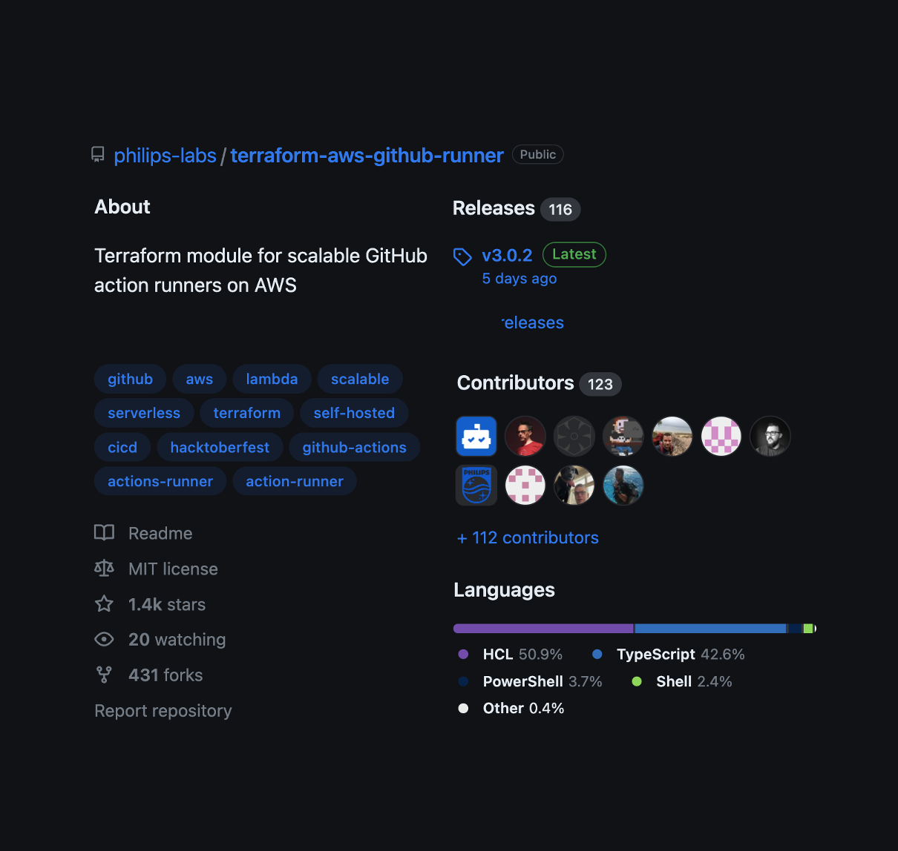

<!-- 

topics we could cover

- PR checks automated
- Automated release
- Slack
- Build a community

# Contribution

- Support windows
- Support ARM
- Support GHES
- Better docs
- Security improvements
- Upgrades

 -->

---

<!--
_backgroundColor: #DE7C00
_color: #9B3426
-->

# <!-- fit --> Running at Scale

# <!-- fit --> in Philips


---


<!--
_backgroundColor: #DE7C00
_color: #9B3426
-->

# <!-- fit --> Running at Scale

# <!-- fit --> in Philips


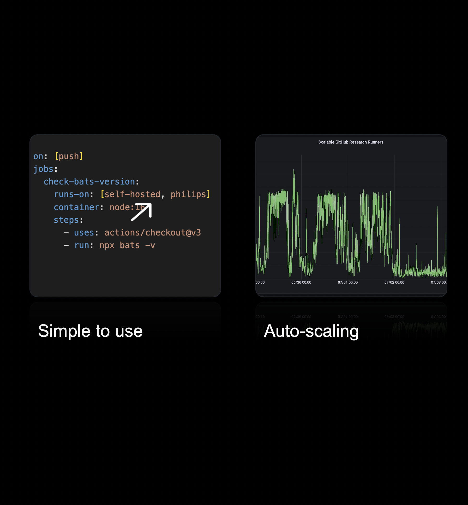


---


<!--
_backgroundColor: #191a1a
_color: #ffffff
-->

<style scoped>
section {
  font-size: 45px;
}
</style>

🧑‍💻 4K+ developers

🗃️ 8K+ repositories

🚀 20K+ obs / day


---

<!--
_backgroundColor: #8345BA
_color: #3D0F58
-->

# Deployment

* Deploy runners with the runners
* Terragrunt to keep our Terraform dry
* Connect to Philips with AWS Direct Connect
* Work together with security to change firewall rules


---
<!--
_backgroundColor: #8345BA
_color: #3D0F58
-->

# Deployment - Terragrunt

<br>
<br>
<br>
<br>
<br>
<br>
<br>
<br>
<br>
<br>
<br>


---

<!--
_backgroundColor: #8345BA
_color: #3D0F58
-->

# Deployment - OIDC

Can we avoid using keys?

* Define OIDC provider for GitHub in AWS
* Create role with trust based on claim
* Define policies for role


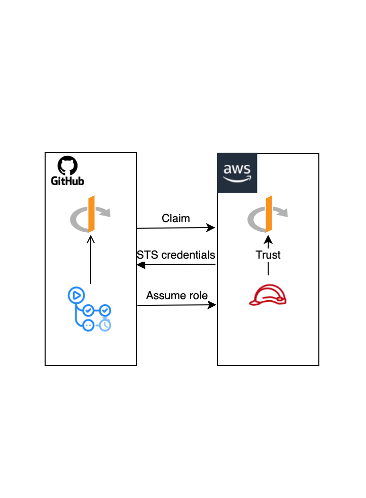


---

<!--
_backgroundColor: #8345BA
_color: #3D0F58
-->

# Deployment


Trust

```json
{
    "Sid": "",
    "Effect": "Allow",
    "Principal": {
        "Federated": "arn:aws:iam::<id>:oidc-provider/token.actions.githubusercontent.com"
    },
    "Action": "sts:AssumeRoleWithWebIdentity",
    "Condition": {
        "StringLike": {
            "token.actions.githubusercontent.com:sub": "<claim>"
        }
    }
}
```

Action

```yaml
jobs:
  permissions:
    id-token: write

  deploy:
    steps:
      - uses: aws-actions/configure-aws-credentials@v2
        with:
          role-to-assume: ${{ inputs.aws_role_to_assume }}
          aws-region: ${{ inputs.aws_region }}
```


---

# Lessons learned


---

<!--
_backgroundColor:  #002C77
_color: #93C2F8
-->

# <!-- fit --> 🚀 It works 🚀


---

<!--
_backgroundColor:  #002C77
_color: #93C2F8
-->

# Speed

* Caching GitHub runner binary
* Pre-build AMI
* Utilize Insance store


---

<!--
_backgroundColor:  #002C77
_color: #93C2F8
-->

# CI DOS Attack

<style scoped>
section {
  text-align: center;
}
</style>

<br>
<br>
<br>
<br>
<br>
<br>
<br>
<br>


We don't own it - It just work - We dont care

---

# Rate Limits


---

# Monitor

* How long are you users waiting?
* Are you developers waiting forever?
* How dow we find our sweet spot?


---


<!--
_backgroundColor: #110d0d
_color: #0072DA
-->

# <!-- fit --> Developer Portal

> Build an ecosystem, not a wilderness

- Software Catalogus
- Bootstrap / Scaffolding
- TechDocs
- Plugins


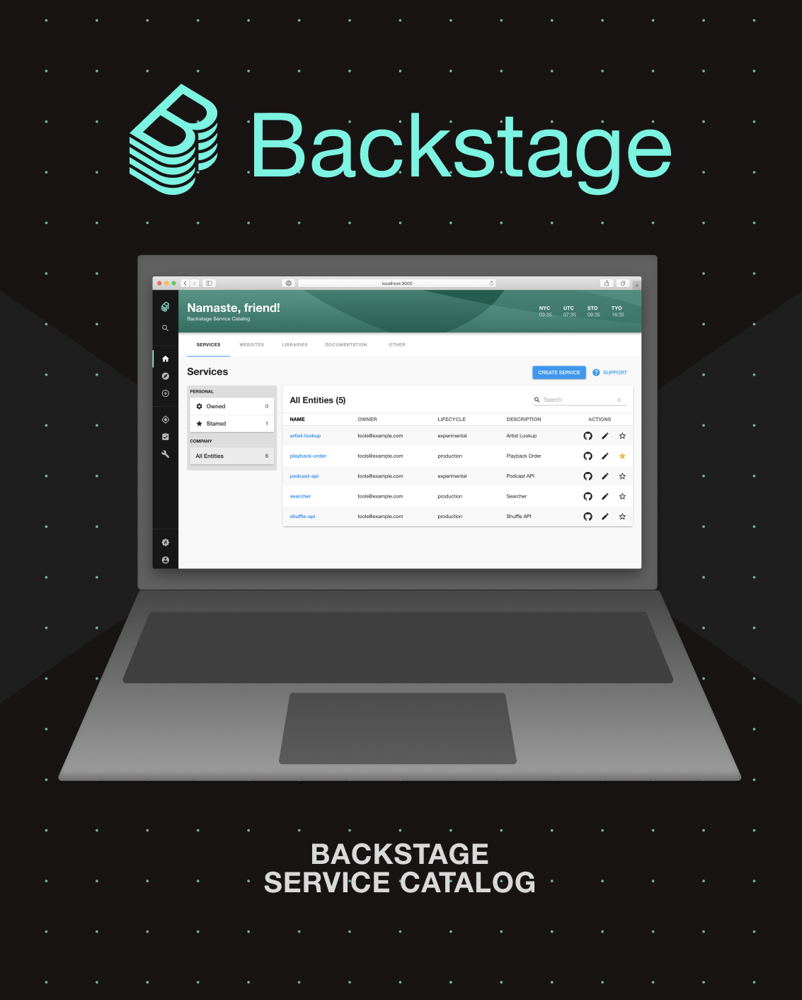


---

<!--
_backgroundColor: #000000
_color: #0072DA
-->

# Software Catalogus


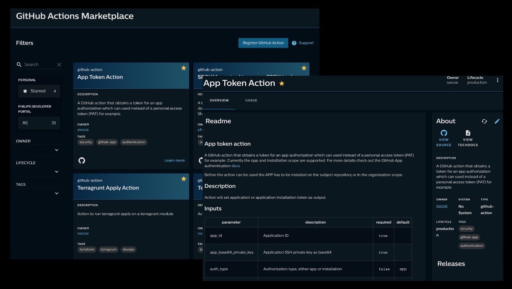

---

<!--
_backgroundColor: #000000
_color: #0072DA
-->

# Scaffolding


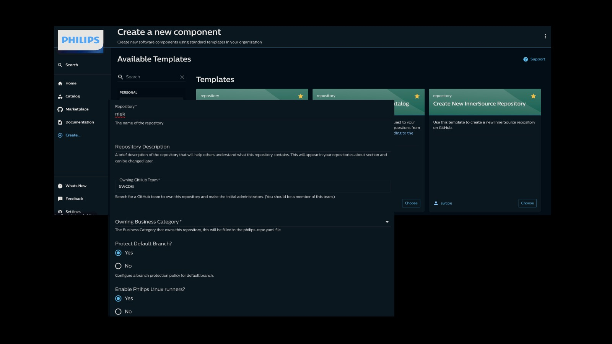

---

<!--
_backgroundColor: #000000
_color: #0072DA
-->

# TechDocs


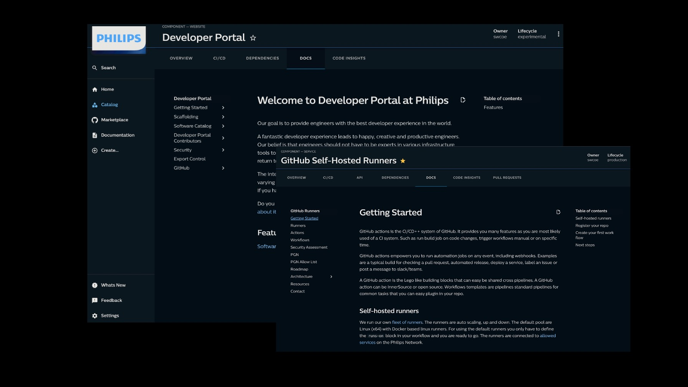

---

<!--
_backgroundColor: white
_color: #0072DA
-->

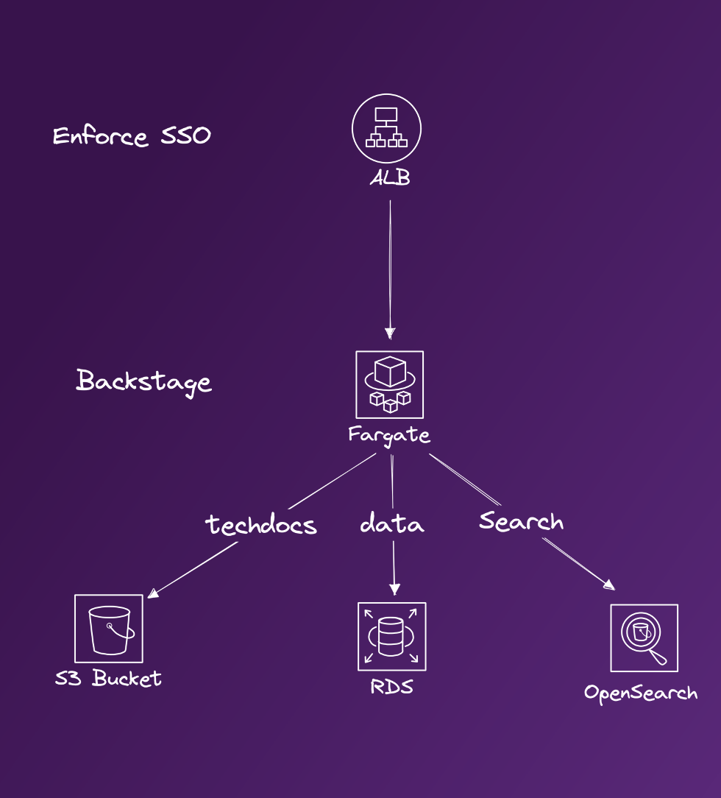

# <!-- fit --> 🥲 not 100% serverless

- ALB to enforce SSO login
- Fargate to serve Backstage 
- OpenSearch to speed up searches
- S3 to serve TechDocs


---

<!--
_backgroundColor: #D10077
_color: #EABEDB
-->

# Compliance

* Assist to do it right - scaffolding
* Avoid shadow IT - e.g. runners
* Continuous compliance - rule based
* Guide - welcome issue new members


---


<!--
_backgroundColor: #D10077
_color: #EABEDB
-->

# Welcome new members

<br>
<br>
<br>
<br>
<br>
<br>
<br>
<br>
<br>
<br>
<br>
<br>


---

# Questions

<style scoped>
h1 {
  font-size: 120px;
}
</style>

https://sli.do use code: #geecon


---
<!--
_backgroundColor: black
-->

```hcl
# Resources

resource "website" "github_runners" {
  url = "github.com/philips-labs/terraform-aws-github-runner"
}

resource "website" "github_oidc" {
  url = "github.com/philips-labs/terraform-aws-github-oidc"
}

resource "website" "slides" {
  url = "github.com/todo"
}

resource "contact" "niek" {
  github   = "@npalm"
  linkedin = "in/niekpalm/"
  twitter  = "@niekos77"
}


```


---

<!--
_backgroundColor: #D10077
_color: purple
-->

# <!-- fit --> Thank You
<br>
<br>
<br>


